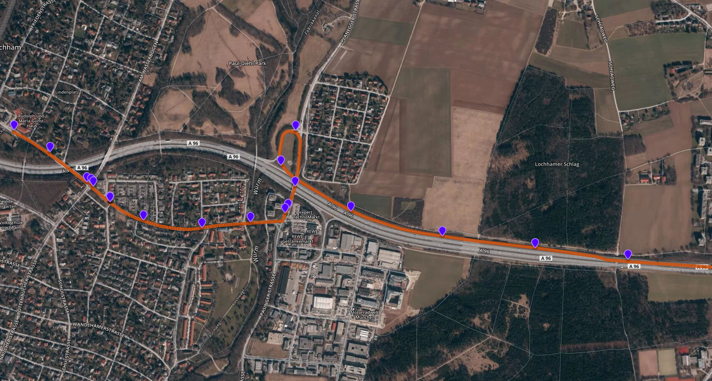
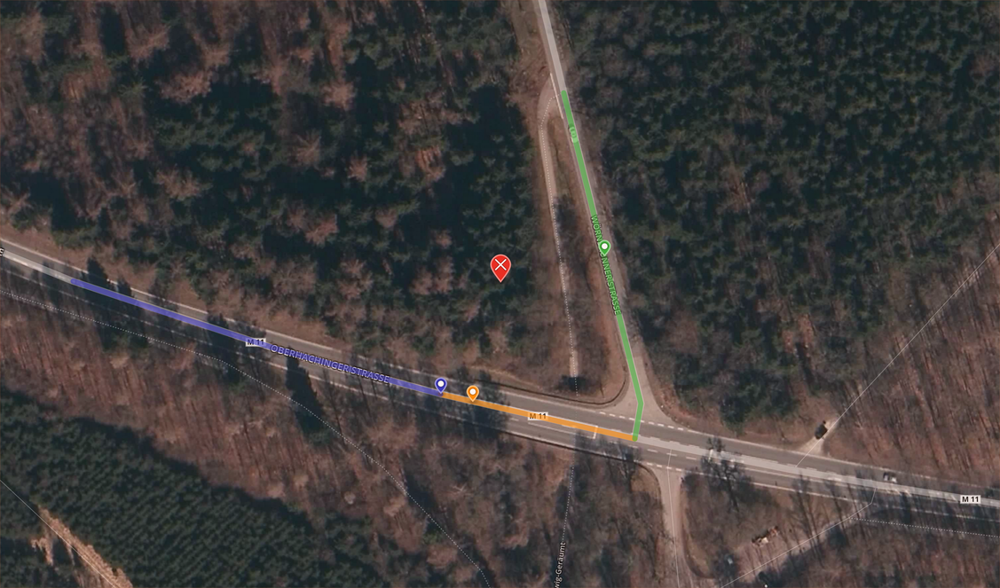
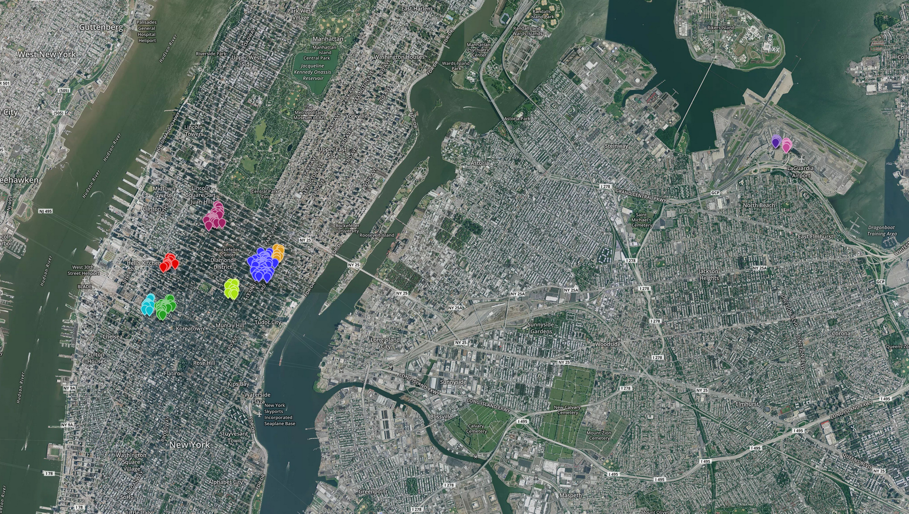

# Barefoot

An open source Java library for online and offline map matching with OpenStreetMap. Together with its extensive set of geometric and spatial functions, an in-memory map data structure and basic machine learning functions, it is a versatile basis for scalable location-based services and spatio-temporal data analysis on the map. It is designed for use in parallel and distributed systems and, hence, includes a stand-alone map matching server and can be used in distributed systems for map matching services in the cloud.

#### State-of-the-art map matching

Barefoot uses a Hidden Markov Model map matching algorithm, proposed by Newson and Krumm (Microsoft Research) in [1], together with OpenStreetMap data. It supports both, offline and online map matching [2]. Most applications rely on offline map matching, which matches a recorded GPS trace in a single step. In contrast, online map matching determines object positions and movements iteratively from live GPS position updates in real-time.

#### Flexible and extensive

The Barefoot (eco-) system consists of a software library and a container-based (Docker) map server setup (Figure 3), which is flexible to be used as a central map repository in a distributed system or side-by-side with Barefoot's stand-alone map matching server in a single node system. Access to map data is provided with a fast and flexible in-memory map data structure. Together with GeographicLib [3] and ESRI's geometry API [4], it provides an extensive set of geographic and geometric operations for spatial data analysis on the map.

<p align="center">

</p>

#### Scalable and versatile

Barefoot is designed for use in parallel and distributed high-throughput systems [5]. For processing large amounts of data batches (offline map matching), it can be easily integrated in Apache Hadoop or Apache Spark (see example below), whereas Apache Storm and Apache Spark Streaming provide a runtime environment for processing massive data streams (online map matching). To support other data analysis functions, Barefoot comes with basic machine learning support, e.g., DBSCAN for spatial cluster analysis [6]. Further machine learning support is planned for future releases.

#### Open source and open data

Barefoot is licensed under the business-friendly Apache License 2.0 and uses only business-friendly open source software with open map data from OpenStreetMap.

## Documentation

### Manual

See [here](MANUAL.md).

### Javadoc

See [here](http://bmwcarit.github.io/barefoot/doc/index.html).

## Showcases and Quick Starts

### Matcher server (Quick Start)

Map matching of a GPS trace (violet markers) in Munich city area shown as geometrical path (orange path)

<p align="center">

<br/>
<a href="https://www.mapbox.com/about/maps/">&#xA9; Mapbox</a> <a href="http://www.openstreetmap.org/">&#xA9; OpenStreetMap</a> <a href="https://www.mapbox.com/map-feedback/"><b>Improve this map</b></a> <a href="https://www.digitalglobe.com/">&#xA9; DigitalGlobe</a> <a href="http://geojson.io">&#xA9; geojson.io</a>
</p>

##### Map server

_Note: The following example uses the setup of the test map server. For further details, see the [manual](MANUAL.md#map-server)._

1. Install prerequisites.

  - Docker (version 1.6 or higher, see [https://docs.docker.com/installation/ubuntulinux/](https://docs.docker.com/installation/ubuntulinux/))
  - Maven (e.g. with `sudo apt-get install maven`)
  - Java JDK (Java version 7 or higher, e.g. with `sudo apt-get install openjdk-1.7-jdk`)

2. Download OSM extract (examples require `oberbayern.osm.pbf`)

  ``` bash
curl http://download.geofabrik.de/europe/germany/bayern/oberbayern-latest.osm.pbf -o barefoot/map/osm/oberbayern.osm.pbf
  ```

3. Build Docker image.

  ``` bash
cd barefoot
sudo docker build --rm=true -t barefoot-map ./map
  ```

4. Create Docker container.

  ``` bash
sudo docker run -it -p 5432:5432 --name="barefoot-oberbayern" -v ${PWD}/map/:/mnt/map barefoot-map
  ```

5. Import OSM extract (in the container).
  
  ``` bash
root@acef54deeedb# bash /mnt/map/osm/import.sh
  ```

  _Note: To detach the interactive shell from a running container without stopping it, use the escape sequence Ctrl-p + Ctrl-q._

6. Make sure the container is running ("up").

  ``` bash
sudo docker ps -a
...
  ```

  _Note: The output of the last command should show status 'Up x seconds'._

##### Matcher server

_Note: The following example is a quick start setup. For further details, see the [manual](MANUAL.md#map-matching-server-stand-alone)._

1. Package Barefoot JAR. (Includes dependencies and executable main class.)

  ``` bash
mvn package
  ```

  _Note: Add `-DskipTests` to skip tests._

2. Start server with standard configuration for map server and map matching, and option for GeoJSON output format.

  ``` bash
java -jar target/barefoot-0.1.0-server-jar-with-dependencies.jar --geojson config/server.properties config/oberbayern.properties
  ```

  _Note: Stop server with Ctrl-c._

3. Test setup with provided sample data.

  ``` bash
python util/submit/batch.py --host localhost --port 1234  --file src/test/resources/com/bmwcarit/barefoot/matcher/x0001-015.json
SUCCESS
...
  ```

  _Note: On success, i.e. result code is SUCCESS, the output can be visualized with [http://geojson.io/](http://geojson.io/) and should show the same path as in the figure above. Otherwise, result code is either TIMEOUT or ERROR._

### Tracker server (Quick Start)

Online (real-time) map matching of a GPS trace in Munich city area with most likely position (blue dot) and alternative possible positions and routes (green dots and paths with transparency according to their probability). Alternative positions and routes disappear with continuously processed updates, which shows the principle of online map matching converging alternatives over time.

<p align="center">

</p>

##### Map server

(see above)

##### Tracker server

_Note: The following example is a quick start setup. For further details, see the [manual](MANUAL.md#map-matching-server-stand-alone)._

1. Install prerequisites.

  - ZeroMQ (e.g. with `sudo apt-get install libzmq3-dev`)
  - NodeJS (e.g. with `sudo apt-get install nodejs`)

2. Package Barefoot JAR. (Includes dependencies and executable main class.)

  ``` bash
mvn package
  ```

  _Note: Add `-DskipTests` to skip tests._

3. Start tracker with standard configuration for map server, map matching, and tracking.

  ``` bash
java -jar target/barefoot-0.1.0-tracker-jar-with-dependencies.jar config/tracker.properties config/oberbayern.properties
  ```

  _Note: Stop server with Ctrl-c._

4. Install and start monitor (NodeJS server).

  Install (required only once)
  ``` bash
cd util/monitor && npm install && cd ../..
  ```
  ... and start:
  ``` bash
node util/monitor/monitor.js 3000 127.0.0.1 1235
  ```

5. Test setup with provided sample data.

  ``` bash
python util/submit/stream.py --host localhost --port 1234 --file src/test/resources/com/bmwcarit/barefoot/matcher/x0001-001.json
SUCCESS
...
  ```

  _Note: On success, i.e. result code is SUCCESS, the tracking is visible in the browser on [http://localhost:3000](http://localhost:3000). Otherwise, result code is either TIMEOUT or ERROR._

#### Map matching API (online and offline)

The Barefoot library provides an easy-to-use HMM map matching API for online and offline map matching.

- In (near) real-time systems, objects measure their position with some frequency producing a stream of position measurement. Each position measurement of the stream is map matched right away, which is referred to as __online map matching__.
- In contrast, many applications use batches of position measurements recorded some time in the past. Map matching such a batches is referred to as __offline map matching__.

For further API details and information on the theory of HMM map matching, see the [manual](MANUAL.md#map-matching-api).

### Spatial search and operations

#### Spatial operations

A straight line between two points, here Reykjavik (green marker) and Moskva (blue marker), on the earth surface is  a geodesic (orange). The closest point on a geodesic to another point, here Berlin (violet marker), is referred to as the interception point (red marker).

<p align="center">

<br/>
<a href="https://www.mapbox.com/about/maps/">&#xA9; Mapbox</a> <a href="http://www.openstreetmap.org/">&#xA9; OpenStreetMap</a> <a href="https://www.mapbox.com/map-feedback/"><b>Improve this map</b></a> <a href="https://www.digitalglobe.com/">&#xA9; DigitalGlobe</a> <a href="http://geojson.io">&#xA9; geojson.io</a>
</p>

``` java
import com.bmwcarit.barefoot.spatial.Geography;
import com.bmwcarit.barefoot.spatial.SpatialOperator;

import com.esri.core.geometry.Point;

SpatialOperator spatial = new Geography();

Point reykjavik = new Point(-21.933333, 64.15);
Point moskva = new Point(37.616667, 55.75);
Point berlin = new Point(13.408056, 52.518611);

double f = spatial.intercept(reykjavik, moskva, berlin);
Point interception = spatial.interpolate(reykjavik, moskva, f);
```

Other spatial operations and formats provided with GeographicLib and ESRI Geometry API:

- Geodesics on ellipsoid of rotation (lines on earth surface)
- Calculation of distances, interception, intersection, etc.
- WKT (well-known-text) import/export
- GeoJSON import/export
- Geometric operations (convex hull, overlap, contains, etc.)
- Quad-tree spatial index

#### Spatial search

Spatial radius search in the road map given a center point (red marker) returns road segments (colored lines) and closest points (colored markers) on the road.

<p align="center">

<br/>
<a href="https://www.mapbox.com/about/maps/">&#xA9; Mapbox</a> <a href="http://www.openstreetmap.org/">&#xA9; OpenStreetMap</a> <a href="https://www.mapbox.com/map-feedback/"><b>Improve this map</b></a> <a href="https://www.digitalglobe.com/">&#xA9; DigitalGlobe</a> <a href="http://geojson.io">&#xA9; geojson.io</a>
</p>

``` java
import com.bmwcarit.barefoot.road.PostGISReader;
import com.bmwcarit.barefoot.road.RoadReader;
import com.bmwcarit.barefoot.roadmap.RoadMap;
import com.bmwcarit.barefoot.roadmap.RoadPoint;

import com.esri.core.geometry.GeometryEngine;

RoadReader reader = new PostGISReader(...);
RoadMap map = RoadMap.Load(reader);
map.construct();

Point c = new Point(11.550474464893341, 48.034123185269095);
double r = 50; // radius search within 50 meters
Set<RoadPoint> points = map.spatial().radius(c, r);

for (RoadPoint point : points) {
	GeometryEngine.geometryToGeoJson(point.geometry()));
	GeometryEngine.geometryToGeoJson(point.edge().geometry()));
}
```

The provided spatial search operations are:

- radius
- nearest
- k-nearest neighbors

### Simple routing (Dijkstra)

TBD.

### Spatial cluster analysis

Spatial cluster analysis of trip start and target points for a New York City taxi driver in January 2013. (The shown example is data of the New York hack license BA96DE419E711691B9445D6A6307C170. For details of the dataset, see below.)

<p align="center">

<br/>
<a href="https://www.mapbox.com/about/maps/">&#xA9; Mapbox</a> <a href="http://www.openstreetmap.org/">&#xA9; OpenStreetMap</a> <a href="https://www.mapbox.com/map-feedback/"><b>Improve this map</b></a> <a href="https://www.digitalglobe.com/">&#xA9; DigitalGlobe</a> <a href="http://geojson.io">&#xA9; geojson.io</a>
</p> 

``` java
import com.bmwcarit.barefoot.analysis.DBSCAN;

import com.esri.core.geometry.GeometryEngine;
import com.esri.core.geometry.MultiPoint;
import com.esri.core.geometry.Point;

List<Point> points = new LinkedList<Point>();
...
// DBSCAN algorithm with radius neighborhood of 100 and minimum density of 10
Set<List<Point>> clusters = DBSCAN.cluster(points, 100, 10);

for (List<Point> cluster : clusters) {
	MultiPoint multipoint = new MultiPoint();
	for (Point point : cluster) {
		multipoint.add(point);
	}
	GeometryEngine.geometryToGeoJson(multipoint);
}
```

## License

Copyright 2015 BMW Car IT GmbH

Licensed under the Apache License, Version 2.0 (the "License");
you may not use this file except in compliance with the License.
You may obtain a copy of the License at

[http://www.apache.org/licenses/LICENSE-2.0](http://www.apache.org/licenses/LICENSE-2.0)

Unless required by applicable law or agreed to in writing, software
distributed under the License is distributed on an "AS IS" BASIS,
WITHOUT WARRANTIES OR CONDITIONS OF ANY KIND, either express or implied.
See the License for the specific language governing permissions and
limitations under the License.

## Maintainer(s)

- Sebastian Mattheis

## Contributors

- Richard Zinck (review and feedback)
- Muthu Kumar Kumar (visualization for debugging)
- Sahbi Chaieb (map matching evaluation)
- Bastian Beggel (in-memory road map review and evaluation)
- Heiko Greiner, TU Dresden (feedback and testing data for bugfixing high sampling rate map-matching)

## Dependencies

#### Barefoot library

_The following dependencies are linked only dynamically in the Java source of Barefoot. They can be resolved usually automatically with Maven. For details, see [NOTICE.txt](NOTICE.txt)._

* ESRI Geometry API, 1.1, Apache-2.0 ([https://github.com/Esri/geometry-api-java](https://github.com/Esri/geometry-api-java))
 * Java, JSON 20090211 (see below)
 * Jackson, 1.9.12, Apache-2.0 ([https://github.com/FasterXML/jackson-core](https://github.com/FasterXML/jackson-core))
* GeographicLib-Java, 1.43, MIT License ([http://geographiclib.sourceforge.net/](http://geographiclib.sourceforge.net/))
* Java JSON, 20090211, MIT License with extra clause "The Software shall be used for Good, not Evil." ([http://www.json.org](http://www.json.org))
* PostgreSQL JDBC, 9.2-1003-jdbc4, BSD 3-Clause ([http://jdbc.postgresql.org/about/license.html](http://jdbc.postgresql.org/about/license.html))
* JUnit, 4.11, CPL-1.0 ([https://github.com/junit-team/junit](https://github.com/junit-team/junit))
 * Hamcrest, 1.3, BSD 3-Clause ([https://github.com/hamcrest/JavaHamcrest](https://github.com/hamcrest/JavaHamcrest))
* SLF4J, 1.7.10, MIT License ([http://slf4j.org](http://slf4j.org))
* Logback, 1.0.9, LGPL-2.1 ([http://logback.qos.ch](http://logback.qos.ch/))
 * SLF4J, 1.7.10 (see above)
 * Logback core, 1.0.9, LGPL-2.1 ([http://logback.qos.ch](http://logback.qos.ch/))
* JeroMQ, 0.3.5, LGPL-3.0 ([https://github.com/zeromq/jeromq](https://github.com/zeromq/jeromq))

#### Barefoot map

_The following dependencies are not linked in any source but used for setting up map servers._

* Docker, Apache License 2.0 ([https://www.docker.com](https://www.docker.com))<br/>
  _Note: Docker is used only as a tool for setting up map databases, e.g. in the test setup._
* PostgreSQL, PostgreSQL License ([http://www.postgresql.org/](http://www.postgresql.org/))
* PostGIS, GPL-2.0 ([http://postgis.net/](http://postgis.net/))
* Osmosis, GPL-3 ([https://github.com/openstreetmap/osmosis](https://github.com/openstreetmap/osmosis))<br/>
  _Note: A single file from Osmosis project, i.e. pgsnapshot_schema_0.6.sql, is included in directory map/osm but is not compiled in any binary._
* OpenStreetMap, ODbL ([http://download.geofabrik.de](http://download.geofabrik.de))<br/>
  _Note: A sample, i.e. oberbayern.osm.pbf, is required for testing but not included in the source repository._

##### Barefoot map tools

_The following dependencies are linked only dynamically in the Python source of map server tools for importing data into the map server._

* psycopg 'psycopg2', LGPL-3.0 ([http://initd.org/psycopg/license/](http://initd.org/psycopg/license/))
* NumPy 'numpy', BSD 3-Clause ([http://www.numpy.org/](http://www.numpy.org/))
* GDAL OGR 'osgeo.ogr' 1.10, MIT License ([http://trac.osgeo.org/gdal/wiki/GdalOgrInPython](http://trac.osgeo.org/gdal/wiki/GdalOgrInPython))
* Python Standard Library 2.7.3, Python License ([https://docs.python.org/2/license.html](https://docs.python.org/2/license.html))
 * 'os' ([https://docs.python.org/2/library/os.html](https://docs.python.org/2/library/os.html))
 * 'optparse' ([https://docs.python.org/2/library/optparse.html](https://docs.python.org/2/library/optparse.html))
 * 'getpass' ([https://docs.python.org/2/library/getpass.html](https://docs.python.org/2/library/getpass.html))
 * 'binascii' ([https://docs.python.org/2/library/binascii.html](https://docs.python.org/2/library/binascii.html))
 * 'json' ([https://docs.python.org/2/library/json.html](https://docs.python.org/2/library/json.html))
 * 'unittest' ([https://docs.python.org/2/library/unittest.html](https://docs.python.org/2/library/unittest.html))

#### Barefoot utilities

##### Barefoot monitor

_The following dependencies are linked only dynamically in the NodeJS source of the monitor._

* Socket.io, 1.4.4, and packages, MIT License ([http://socket.io/](http://socket.io/))
* Express, 4.13.4, and packages, MIT License ([https://github.com/strongloop/express](https://github.com/strongloop/express))
  * inherits, 2.0.1, ISC License ([https://www.npmjs.com/package/inherits](https://www.npmjs.com/package/inherits))
  * qs, 4.0.0, BSD 3-Clause ([https://www.npmjs.com/package/qs](https://www.npmjs.com/package/qs))
* ZeroMQ (NodeJS binding), 2.14.0, MIT License ([https://github.com/JustinTulloss/zeromq.node](https://github.com/JustinTulloss/zeromq.node))
  * ZeroMQ (C++), LGPL-3.0 ([https://github.com/zeromq/libzmq](https://github.com/zeromq/libzmq))

_The following dependencies are linked only dynamically in the Javascript source of the monitor._

* OpenLayers 3, BSD 2-Clause ([https://github.com/openlayers/ol3](https://github.com/openlayers/ol3))
* jQuery, MIT License ([http://jquery.com/](http://jquery.com/))
* Socket.io.js, MIT License ([http://socket.io/](http://socket.io/))

##### Job submission scripts

_The following dependencies are linked only dynamically in the Python source of the submission scripts._

* Requests, 2.6.2, Apache License 2.0 ([https://github.com/kennethreitz/requests](https://github.com/kennethreitz/requests))
* Python Standard Library 2.7.3, Python License ([https://docs.python.org/2/license.html](https://docs.python.org/2/license.html))
  * 'os' ([https://docs.python.org/2/library/os.html](https://docs.python.org/2/library/os.html))
  * 'sys' ([https://docs.python.org/2/library/sys.html](https://docs.python.org/2/library/sys.html))
  * 'optparse' ([https://docs.python.org/2/library/optparse.html](https://docs.python.org/2/library/optparse.html))
  * 'json' ([https://docs.python.org/2/library/json.html](https://docs.python.org/2/library/json.html))
  * 'subprocess' ([https://docs.python.org/2/library/subprocess.html](https://docs.python.org/2/library/subprocess.html))
  * 'time' ([https://docs.python.org/2/library/time.html](https://docs.python.org/2/library/time.html))
  * 'datetime' ([https://docs.python.org/2/library/datetime.html](https://docs.python.org/2/library/datetime.html))

##### Documentation
* OpenJUMP, GPL-2.0 ([http://www.openjump.org](http://www.openjump.org))<br/>
  _Note: OpenJUMP project files included in directory openjump for test and debugging purposes._
* Documents and graphics, CC BY 4.0 ([http://creativecommons.org/licenses/by/4.0/legalcode](http://creativecommons.org/licenses/by/4.0/legalcode))<br/>
  _Note: The documentation includes PNG, PDF, TikZ/LaTeX, and Markdown files for this project (mainly included in directory doc-files) and is licensed under CC BY 4.0._

##### Datasets

* Some tests and examples use an extract of NYC taxi data which is included in the source repository. The data is licensed under CC0 license (Public Domain). For details see:
  _Brian Donovan and Daniel B. Work  “New York City Taxi Trip Data (2010-2013)”. 1.0. University of Illinois at Urbana-Champaign. Dataset. http://dx.doi.org/10.13012/J8PN93H8, 2014._

## References

[1] P. Newson and J. Krumm. [Hidden Markov Map Matching Through Noise and Sparseness](http://research.microsoft.com/en-us/um/people/jckrumm/Publications%202009/map%20matching%20ACM%20GIS%20camera%20ready.pdf). In _Proceedings of International Conference on Advances in Geographic Information Systems_, 2009.

[2] C.Y. Goh, J. Dauwels, N. Mitrovic, M.T. Asif, A. Oran, and P. Jaillet. [Online map-matching based on Hidden Markov model for real-time traffic sensing applications](http://www.mit.edu/~jaillet/general/map_matching_itsc2012-final.pdf). In _International IEEE Conference on Intelligent Transportation Systems_, 2012.

[3] [GeographicLib](http://geographiclib.sourceforge.net/).

[4] [ESRI's Geometry API](https://github.com/Esri/geometry-api-java).

[5] S. Mattheis, K. Al-Zahid, B. Engelmann, A. Hildisch, S. Holder, O. Lazarevych, D. Mohr, F. Sedlmeier, and R. Zinck. [Putting the car on the map: A scalable map matching system for the Open Source Community](http://subs.emis.de/LNI/Proceedings/Proceedings232/2109.pdf). In _INFORMATIK 2014: Workshop Automotive Software Engineering_, 2014.

[6] M. Ester, H.-P. Kriegel, J. Sander, X. Xu. [A Density-based algorithm for discovering clusters in large spatial databases with noise](https://www.aaai.org/Papers/KDD/1996/KDD96-037.pdf). In _Proceedings of the Second International Conference on Knowledge Discovery and Data Mining (KDD-96)_, 1996. 
